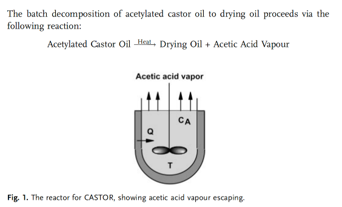

### Problem: Maximizing Yield in the Batch Decomposition of Acetylated Castor Oil

## Input

In the production of drying oils, the goal is to maximize the conversion of acetylated castor oil within a fixed batch time $t_f$. Because the reaction is endothermic and involves the continuous loss of mass (acetic acid vapor), the heating rate $Q$ must be optimized to maintain an ideal reaction temperature without exceeding equipment limits or causing thermal degradation.

## Input

### 1. Variables

- $Q(t)$: Heat input rate (J/s or W).

### 2. Objective Function

$$\min_{Q(t)} \quad J = 1 - X_A(t_f) = \frac{M(t_f) C_A(t_f)}{M_0 C_{A0}}$$

### 3. Constraints

Total Mass Balance:
$$\frac{dM}{dt} = -k C_A M$$

Component Balance:
$$\frac{d(M C_A)}{dt} = -k C_A M$$

Energy Balance:
$$M C_p \frac{dT}{dt} = -k C_A M \Delta H + Q(t)$$

Temperature limits: 
$$T_{min} \le T(t) \le T_{max}$$

Heating limits: 
$$0 \le Q(t) \le Q_{max}$$

Time horizon: 
$$t \in [0, t_f]$$

​	
 